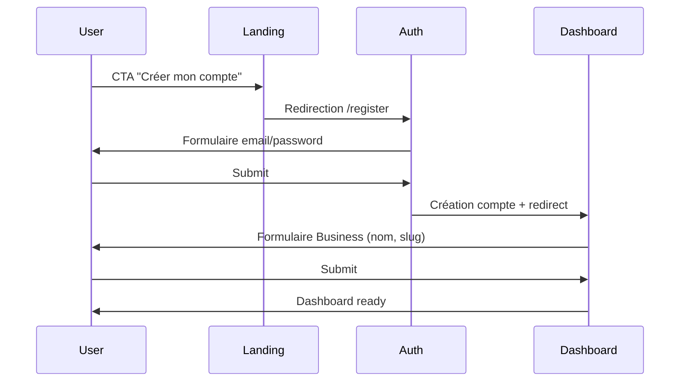
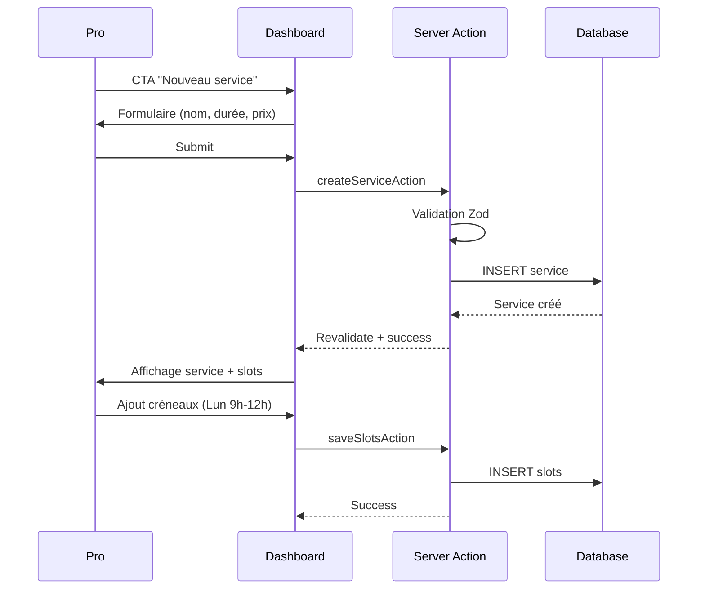
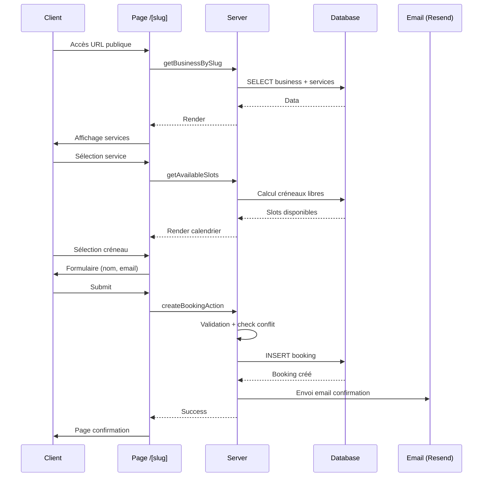

# Architecture MVP — Rendez

> **Version**: 1.0.0 | **Dernière mise à jour**: 2024-03-13 | **Statut**: Validé

---

## Vue d'ensemble

```mermaid
┌─────────────────────────────────────────┐
│           Landing (marketing)           │
│    Pré-inscription, pricing, contact    │
└─────────────────────────────────────────┘
                    │
                    ▼
┌─────────────────────────────────────────┐
│           Auth (NextAuth v5)            │
│    Email + Google OAuth + Credentials   │
└─────────────────────────────────────────┘
                    │
                    ▼
┌─────────────────────────────────────────┐
│         Dashboard Pro (app)             │
│  ┌─────────┐ ┌─────────┐ ┌──────────┐ │
│  │ Services│ │Calendar │ │ Settings │ │
│  │   CRUD  │ │  View   │ │ + Stripe │ │
│  └─────────┘ └─────────┘ └──────────┘ │
└─────────────────────────────────────────┘
                    │
                    ▼
┌─────────────────────────────────────────┐
│      Page Publique Réservation          │
│   /[slug] → Calendrier → Confirmation   │
│   (Paiement en mode démo S1)            │
└─────────────────────────────────────────┘
```

---

## Principes directeurs

1. **Server-First** : Server Components par défaut, Client Components uniquement pour l'interactivité
2. **Type Safety** : TypeScript strict + Zod pour toutes les validations
3. **Database-First** : Prisma comme source de vérité, migrations versionnées
4. **Progressive Enhancement** : Fonctionnel sans JS, enrichi avec JS
5. **Mobile-First** : Design responsive, touch-friendly

---

## Stack détaillée

### Frontend

| Technologie | Version | Usage |
|-------------|---------|-------|
| Next.js | 14.x | App Router, SSR, API Routes |
| React | 18.x | UI Components |
| TypeScript | 5.3.x | Type safety |
| Tailwind CSS | 3.4.x | Styling utility-first |
| shadcn/ui | latest | Composants accessibles |
| Lucide React | latest | Icônes |

### Backend

| Technologie | Version | Usage |
|-------------|---------|-------|
| Next.js Server Actions | 14.x | Mutations serveur |
| Auth.js (NextAuth) | 5.0.0-beta | Authentification |
| Zod | 3.22.x | Validation schémas |
| date-fns | 3.x | Manipulation dates |

### Database

| Technologie | Version | Usage |
|-------------|---------|-------|
| PostgreSQL | 15.x | Données relationnelles |
| Prisma | 5.7.x | ORM, migrations, client |
| Neon | - | PostgreSQL serverless |

### External Services

| Service | Usage | Sprint |
|---------|-------|--------|
| **Vercel** | Hosting, CI/CD, Analytics | S1 |
| **Neon** | PostgreSQL serverless | S1 |
| **Resend** | Emails transactionnels | S1 |
| **Stripe Connect** | Onboarding marchands | S1 |
| **Stripe Checkout** | Paiement client | S2 |
| **Twilio** | SMS rappels | S2 |

---

## Architecture des dossiers

```
src/
├── 📁 app/                          # Next.js App Router
│   ├── 📁 (marketing)/              # Groupe: pages publiques sans auth
│   │   ├── layout.tsx               # Layout marketing (header/footer)
│   │   ├── page.tsx                 # Landing page
│   │   └── pricing/
│   │
│   ├── 📁 (auth)/                   # Groupe: auth pages
│   │   ├── layout.tsx               # Layout minimal (sans sidebar)
│   │   ├── login/
│   │   └── register/
│   │
│   ├── 📁 (app)/                    # Groupe: dashboard (auth requis)
│   │   ├── layout.tsx               # Layout avec sidebar + auth check
│   │   ├── dashboard/               # Vue d'ensemble
│   │   ├── services/                # CRUD prestations
│   │   ├── calendar/                # Vue calendrier
│   │   └── settings/                # Profil + Stripe
│   │
│   ├── 📁 (public)/                 # Groupe: booking public
│   │   └── [slug]/                  # Page réservation par business
│   │
│   ├── 📁 api/                      # API Routes (webhooks uniquement)
│   │   └── webhooks/
│   │       └── stripe/
│   │
│   ├── globals.css                  # Variables CSS + Tailwind
│   └── layout.tsx                   # Root layout
│
├── 📁 components/
│   ├── 📁 ui/                       # shadcn/ui components
│   │   ├── button.tsx
│   │   ├── input.tsx
│   │   ├── calendar.tsx
│   │   └── ...
│   │
│   ├── 📁 forms/                    # Formulaires métier
│   │   ├── service-form.tsx
│   │   ├── slot-form.tsx
│   │   └── booking-form.tsx
│   │
│   └── 📁 calendar/                 # Composants calendrier
│       ├── week-view.tsx
│       └── slot-picker.tsx
│
├── 📁 lib/                          # Utilitaires et configs
│   ├── prisma.ts                    # Singleton Prisma client
│   ├── auth.ts                      # Config Auth.js
│   ├── db.ts                        # Queries complexes
│   └── utils.ts                     # Helpers (cn, formatters)
│
├── 📁 server/                       # Code serveur uniquement
│   ├── 📁 actions/                  # Server Actions
│   │   ├── auth.ts
│   │   ├── services.ts
│   │   ├── slots.ts
│   │   └── bookings.ts
│   │
│   ├── 📁 schemas/                  # Zod validations
│   │   ├── service.ts
│   │   ├── slot.ts
│   │   └── booking.ts
│   │
│   └── 📁 queries/                  # Requêtes complexes (optionnel)
│
└── 📁 types/                        # Types globaux TypeScript
    └── index.ts
```

---

## Modèle de données

### Diagramme ER

```
┌─────────────┐       ┌─────────────┐       ┌─────────────┐
│    User     │◄──────┤  Business   │◄──────┤   Service   │
│  (NextAuth) │   1:1 │  (Profil)   │   1:n │(Prestation) │
└─────────────┘       └─────────────┘       └──────┬──────┘
                                                   │
                          ┌─────────────┐         │
                          │    Slot     │◄────────┘
                          │(Disponibilité)   1:n
                          └─────────────┘
                                   │
                                   ▼
                          ┌─────────────┐
                          │   Booking   │
                          │(Réservation)│
                          └─────────────┘
```

### Détails des entités

#### User (Auth)
- Géré par NextAuth.js
- Email + OAuth Google
- Relation 1:1 avec Business

#### Business (Profil pro)
- `slug`: URL publique unique (`rendez.co/salon-marie`)
- `stripeAccountId`: Compte Connect Stripe (S2)
- Relations: User (1:1), Services (1:n), Bookings (1:n)

#### Service (Prestation)
- `duration`: Minutes (ex: 30)
- `price`: Centimes (ex: 2500 = 25€)
- `color`: Hex pour calendrier
- Relations: Business (n:1), Slots (1:n), Bookings (1:n)

#### Slot (Disponibilité récurrente)
- `dayOfWeek`: 0 (Dim) à 6 (Sam)
- `startTime`/`endTime`: Format "HH:MM"
- Relation: Service (n:1)

#### Booking (Réservation)
- `startTime`/`endTime`: DateTime complet
- `status`: CONFIRMED | CANCELLED | NO_SHOW
- `paymentStatus`: PENDING | PAID | REFUNDED | FAILED
- Relations: Business (n:1), Service (n:1)

---

## Flux utilisateurs

### 1. Onboarding Pro (5 min objectif)



### 2. Configuration Service (2 min objectif)



### 3. Réservation Client (3 min objectif, S1 mode démo)



---

## Conventions de code

### Naming

| Élément | Convention | Exemple |
|---------|------------|---------|
| Fichiers | `kebab-case` | `service-form.tsx` |
| Composants | `PascalCase` | `ServiceForm` |
| Fonctions | `camelCase` | `createService` |
| Server Actions | suffixe `Action` | `createServiceAction` |
| Types/Interfaces | `PascalCase` | `ServiceInput` |
| Enums | `PascalCase` | `BookingStatus` |
| Constants | `SCREAMING_SNAKE` | `MAX_SERVICES` |

### Imports

```typescript
// Ordre recommandé
1. React/Next imports
2. External libraries (date-fns, zod, etc.)
3. Internal aliases (@/components, @/lib, etc.)
4. Relative imports (./, ../)
5. Types
```

### Server Actions Pattern

```typescript
// server/actions/services.ts
"use server";

import { z } from "zod";
import { prisma } from "@/lib/prisma";
import { revalidatePath } from "next/cache";

const createServiceSchema = z.object({
  name: z.string().min(2),
  duration: z.number().min(15),
  price: z.number().min(0),
});

export async function createServiceAction(
  input: z.infer<typeof createServiceSchema>
) {
  // 1. Auth check
  const session = await auth();
  if (!session) throw new Error("Unauthorized");

  // 2. Validation
  const data = createServiceSchema.parse(input);

  // 3. Business logic
  const service = await prisma.service.create({
    data: { ...data, businessId: session.user.businessId },
  });

  // 4. Revalidation
  revalidatePath("/services");

  return { success: true, data: service };
}
```

---

## Sécurité

| Risque | Mitigation |
|--------|------------|
| **Auth** | NextAuth.js + middleware sur routes `/app/*` |
| **CSRF** | Server Actions gèrent automatiquement les tokens |
| **SQL Injection** | Prisma query builder (paramétré) |
| **XSS** | React escape + validation Zod |
| **IDOR** | Vérification ownership dans chaque Server Action |
| **Secrets** | Variables d'environnement, jamais dans le client |

---

## Performance

| Optimisation | Implémentation |
|--------------|----------------|
| **Database** | Indexes sur `slug`, `startTime`, `businessId` |
| **Rendering** | Server Components par défaut |
| **Caching** | `revalidatePath` après mutations |
| **Images** | Next.js Image component |
| **Fonts** | `next/font` pour optimisation |

---

## ADRs (Architecture Decision Records)

### ADR-001: Server Actions vs API Routes

**Contexte**: Comment gérer les mutations serveur ?

**Décision**: Server Actions pour tout sauf webhooks

**Rationale**:
- Moins de boilerplate (pas de routes API)
- Type safety end-to-end
- CSRF automatique
- Progressive enhancement

**Conséquences**: Nécessite Next.js 14+, pas compatible avec API externe

---

### ADR-002: Prisma vs Drizzle

**Contexte**: Quel ORM choisir ?

**Décision**: Prisma

**Rationale**:
- Mature et documenté
- Excellent DX (autocomplétion, migrations)
- Intégration NextAuth.js native
- Prisma Studio pour debug

**Conséquences**: Bundle size plus important, cold start potentiel

---

### ADR-003: Auth.js vs Clerk

**Contexte**: Quelle solution d'auth ?

**Décision**: Auth.js (NextAuth v5)

**Rationale**:
- Open source, pas de vendor lock-in
- Intégration Prisma native
- Flexible (credentials + OAuth)
- Gratuit

**Conséquences**: Plus de configuration manuelle, docs parfois floues sur v5

---

### ADR-004: PostgreSQL vs MySQL

**Contexte**: Quelle base de données ?

**Décision**: PostgreSQL (Neon)

**Rationale**:
- Relations complexes (slots, bookings)
- JSON support si besoin futur
- Neon = serverless, scaling automatique
- Prisma optimise mieux PostgreSQL

**Conséquences**: Coût à volume élevé, vendor Neon

---

## Roadmap technique

| Sprint | Focus | Livrables | Date cible |
|--------|-------|-----------|------------|
| S1 | MVP Core | Auth, services, dispos, page publique, emails | 21/03 |
| S2 | Monétisation | Stripe Connect, Checkout, vrai paiement | 04/04 |
| S3 | Fidélisation | SMS, rappels, sync calendriers | 18/04 |
| S4 | Scale | Analytics, multi-employés, API | 02/05 |

---

## Ressources

- [Next.js Docs](https://nextjs.org/docs)
- [Auth.js Docs](https://authjs.dev)
- [Prisma Docs](https://prisma.io/docs)
- [shadcn/ui Docs](https://ui.shadcn.com)
- [Tailwind Docs](https://tailwindcss.com/docs)